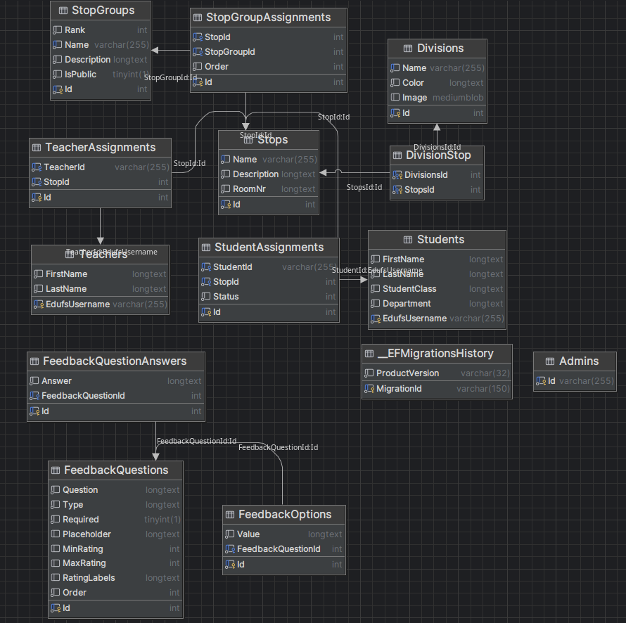

# TadeoTTools
TadeoTTools umfasst ein umfangreiches Admin-Dashboard, mit dem man Stationen, Schüler- und Lehrerzuordnungen und Feedback des **Tages der offenen Tür** verwalten kann. Des Weiteren gibt es eine Mobile Version für die Besucher und Guides des TadeoT. Der Besucher des TadeoT sieht bei unserer Web-App einen Leitfaden (z.B. Besucheranmeldung -> Kurzpräsentationen -> etc.), durch den er unter anderem seine besichtigten Stationen verwalten kann. Am Ende kann der Besucher noch direkt über unsere Website ein Feedback abgeben.

## Team-Mitglieder
- Luca Haas
- Andreas Huber
- Melanie Dohr

## Features
- Stationen und Stationengruppen (im Leitfaden) verwalten (z. B. Name, Ort, Beschreibung)
- Lehrerzuweisungen zu Stationen verwalten
- Schülerzuweisungen durch Lehrer möglich inkl. Konfliktmanagement 
- CSV Import und Export von Feedback, aktuellen Schülerzuweisungen, Stationskonfigurationen
- Feedback-Fragen-Konfigurator
- Anmeldung erfolgt über den Schulaccount via Keycloak
- Als Guide bereits besichtigte Stationen als "erledigt" setzen

## Zukunftsausblick
- Schichtpläne über das Dashboard
- Inwiefern? -> Warteschlangen-Management
- Integration Buffetgutscheinverwaltung
- Standardisierte Lösung

## Technologien
- Frontend: Angular mit Tailwind und DaisyUI
- Backend: .NET mit MySQL

## Datenmodell

